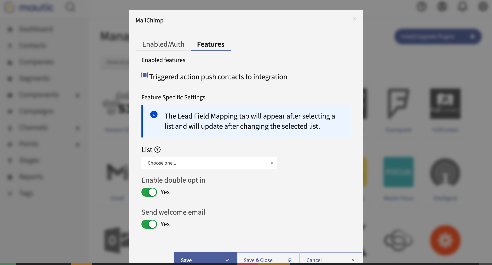

MailChimp
#########

This Plugin can send Contacts to MailChimp lists based on Contact actions or Point Triggers.

Authorize
*********

Get MailChimp API key
=====================

1. Create a MailChimp account.
2. Go to *Account* / *Extras* / *API Keys* and create a new one.
3. Copy the created API Key.
   
  .. image:: images/plugins-mailchimp-create-api-key-1-and-2.png
   :alt: Screenshot of MailChimp dashboard with arrows pointing at the Extras tab and the API Keys section
   :align: center

  .. image:: images/plugins-mailchimp-create-api-key-3a.png
     :alt: Screenshot of MailChimp dashboard with an arrow pointing at the Create API Key button
     :align: center

  .. image:: images/plugins-mailchimp-create-api-key-3b-and-3c.png
     :alt: Screenshot of the Name New API Key section with arrows pointing at the test and Generate Key button
     :align: center

.. vale off

Authorize Mautic - MailChimp Plugin
===================================
1. Fill in with your MailChimp's account **username** 
2. Add the **API key**
3. Click on ***Save & Close***  

Configure the Plugin
********************

.. vale on

Navigate to the *Features* tab in the Plugin configuration modal box. You should see this note:

.. vale off

.. note::
   The Contact Field Mapping tab will appear after selecting a segment and will update after changing the selected segment.
   
   .. vale on

1. Select the Segment.

   If you don't have a Segment in MailChimp created yet, go to *MailChimp dashboard* / *Segments* / *Create List* and create one.

2. Save the Plugin configuration
3. Open it again.

   The *Contact Field Mapping* tab should appear now.

4. Configure the field mapping.

Other configuration options
===========================

- **Push Contacts to this Integration**

Mautic enables these options by default. If you leave them off, the Plugin won't push Contacts to MailChimp.

- **Enable double opt in** - If MailChimp should send a confirmation Email to the Contacts added by this Plugin. The Contacts must confirm that they really want to join the Segment.
- **Send welcome Email** - Whether MailChimp should send the welcome Email.